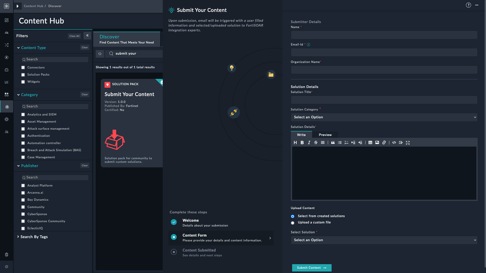

| [Home](../README.md) |
|----------------------|

# Usage

After installation of the solution pack, a *Submit Content Form* button appears on the lower-right of the screen.

1. Click the **Submit Content Form** button to open the following screen.

    

2. Click **Let's Get Started** button to proceed.

    

**Submitter Details**

3. Enter the name of the submitter in the **Name** field.

4. Enter the email address of the submitter in the **Email ID** field.

5. Enter the organization of the submitter in the **Organization Name** field.

**Solution Details**

6. Enter the name of the solution in the **Solution Title** field.

7. Enter the category of the solution in the **Solution Category** field. You can choose from the following options:

    - Connector
    - Solution Pack
    - Widget

8. Enter details associated with the solution in the **Solution Details** field.

9. Select a method for content upload in the **Upload Content** field. You can choose from the following option:

    - **Select from created solutions** - Select the content (connectors, widget, or solution packs) developed in FortiSOAR; using the **Create** tab in Content Hub. For more details, refer to *User Guide* > *Content Hub* > [*Create Tab*](https://docs.fortinet.com/document/fortisoar/7.5.0/user-guide/667127/content-hub#Create_tab).

        The **Select Solution** field lists the content created using FortiSOAR's Content Hub.

    - **Upload a custom file** - Upload a `tgz` file (for connectors and widgets) or a `zip` file (for solution packs) of your content developed in a separate environment.

10. Click **Submit Content** button to complete the submission process.

    

The solution pack is designed to be intuitive and user-friendly, enabling users to submit solutions with ease.

| [Installation](./setup.md#installation) | [Configuration](./setup.md#configuration) |
|-----------------------------------------|-------------------------------------------|